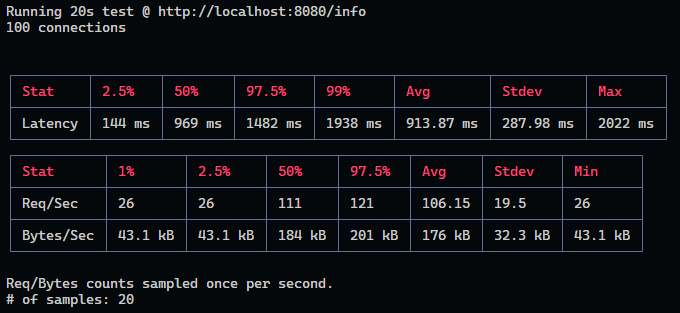

# Preparar el entorno

Ante todo, debemos tener instalado NODE JS.

```sh
git clone https://github.com/dnmartel/Coder-NodeJS.git
npm install
```

## Producción

```sh
npm start
```

## Desarrollo (nodemon)

```sh
npm run dev
```

## Argumentos

```sh
node .\server.js -p XXXX (-p PORT, por defecto 8080)
```

<http://localhost:8080/info> NO requiere estar logueado
<http://localhost:8080/api/randoms?cant=50000> (posibilidad de usar query param "cant", por defecto 100000000)

## Consignas y comandos

#### Incorporar al proyecto de servidor de trabajo la compresión gzip. Verificar sobre la ruta /info con y sin compresión, la diferencia de cantidad de bytes devueltos en un caso y otro

```sh
Se aplica compression a nivel servidor - Se compara en ruta /info --> pasa de 1.5kb a 922 bytes
```

#### Luego implementar loggueo (con alguna librería vista en clase) que registre lo siguiente: -Ruta y método de todas las peticiones recibidas por el servidor (info) -Ruta y método de las peticiones a rutas inexistentes en el servidor (warning) -Errores lanzados por las apis de mensajes y productos, únicamente (error).
Considerar el siguiente criterio: -Loggear todos los niveles a consola (info, warning y error) -Registrar sólo los logs de warning a un archivo llamada warn.log -Enviar sólo los logs de error a un archivo llamada error.log

```sh
Se incorpora una ruta para que matchee aquellas rutas invalidas o no definidas anteriormente.
Se aplica la configuración solicitada a través del archivo alojado en ./log/logger.js
Además, en la misma carpeta se deja registro de los errores y warnings en los archivos solicitados.
```

#### Luego, realizar el análisis completo de performance del servidor con el que venimos trabajando. Vamos a trabajar sobre la ruta '/info', en modo fork, agregando ó extrayendo un console.log de la información colectada antes de devolverla al cliente. Para ambas condiciones (con o sin console.log) en la ruta '/info'
1) El perfilamiento del servidor, realizando el test con --prof de node.js. Analizar los resultados obtenidos luego de procesarlos con --prof-process. Utilizaremos como test de carga Artillery en línea de comandos, emulando 50 conexiones concurrentes con 20 request por cada una. Extraer un reporte con los resultados en archivo de texto

```sh
Resultados dentro de la carpeta /profilling/1
Al ver ambos archivos (result_conlog.txt vs result_sinlog.txt) podemos observar en el apartado de Summary, la diferencia de 
ticks que ocupa la ejecución sin tener el console.log (result_sinlog.txt) es mucho menor (8398) a comparación de la ejecución
que si lo contiene (17228). 
```

#### Luego utilizaremos Autocannon en línea de comandos, emulando 100 conexiones concurrentes realizadas en un tiempo de 20 segundos. Extraer un reporte con los resultados (puede ser un print screen de la consola)


```sh
Imagen adjunta en /profilling/autocannon/autocannon.png
Se pueden observar los siguientes valores corriendo un test de 20 segundos, con 100 conexiones.
┌─────────┬────────┬────────┬─────────┬─────────┬───────────┬───────────┬─────────┐
│ Stat    │ 2.5%   │ 50%    │ 97.5%   │ 99%     │ Avg       │ Stdev     │ Max     │
├─────────┼────────┼────────┼─────────┼─────────┼───────────┼───────────┼─────────┤
│ Latency │ 144 ms │ 969 ms │ 1482 ms │ 1938 ms │ 913.87 ms │ 287.98 ms │ 2022 ms │
└─────────┴────────┴────────┴─────────┴─────────┴───────────┴───────────┴─────────┘
┌───────────┬─────────┬─────────┬────────┬────────┬────────┬─────────┬─────────┐
│ Stat      │ 1%      │ 2.5%    │ 50%    │ 97.5%  │ Avg    │ Stdev   │ Min     │
├───────────┼─────────┼─────────┼────────┼────────┼────────┼─────────┼─────────┤
│ Req/Sec   │ 26      │ 26      │ 111    │ 121    │ 106.15 │ 19.5    │ 26      │
├───────────┼─────────┼─────────┼────────┼────────┼────────┼─────────┼─────────┤
│ Bytes/Sec │ 43.1 kB │ 43.1 kB │ 184 kB │ 201 kB │ 176 kB │ 32.3 kB │ 43.1 kB │
└───────────┴─────────┴─────────┴────────┴────────┴────────┴─────────┴─────────
```

#### 2) El perfilamiento del servidor con el modo inspector de node.js --inspect. Revisar el tiempo de los procesos menos performantes sobre el archivo fuente de inspección

```sh
No se encuentran funciones poco performantes listadas en el archivo server.js dentro del node inspect.
```

#### 3) El diagrama de flama con 0x, emulando la carga con Autocannon con los mismos parámetros anteriores. Realizar un informe en formato pdf sobre las pruebas realizadas incluyendo los resultados de todos los test (texto e imágenes)

```sh
Se adjunta en la carpeta ./profilling/0x/11328.0x/flamegraph.html , junto con el resto de los archivos generados por la herramienta. 
En el se pueden ver procesos cortos, algunos picos pero sin mesetas, lo que nos hace pensar que los procesos se ejecutan sin 
bloqueos y de forma eficiente.
```

#### 👉 Al final incluir la conclusión obtenida a partir del análisis de los datos

```sh
En lineas generales se puede ver en los análisis y pruebas realizadas que el servidor no posee mayores problemas de performance. 
Esto se corrobora despues de ver los test de artillery, node --inspect y autocannon + 0x. También, hay que tener en cuenta que 
cualquier agregado innecesario (como exceso de console.log) pueden afectar al rendimiento del servidor en producción, por lo que 
no son para nada recomendables.
```
